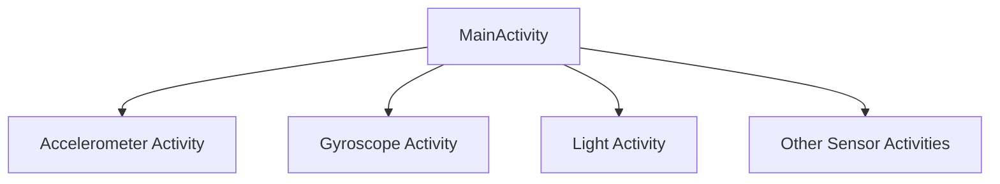
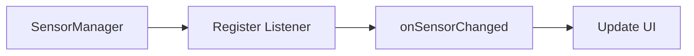
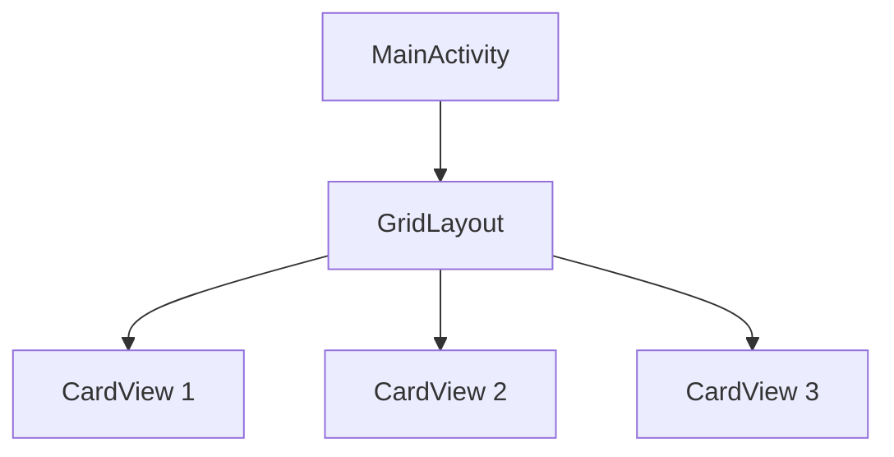
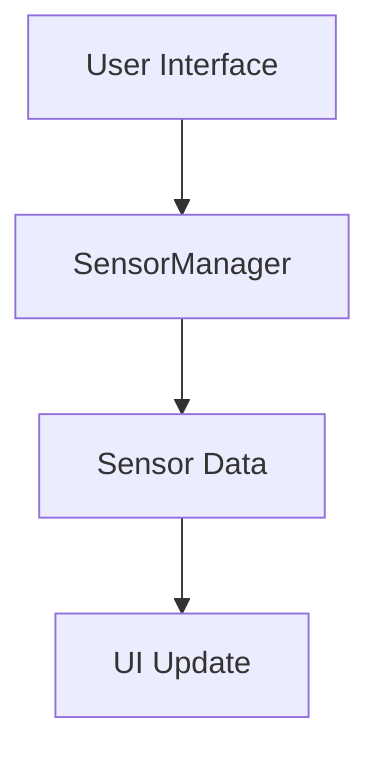

# Sensors List Android App

## What
This Android application lists all available sensors on your Android smartphone and displays their current values along with the minimum and maximum recorded values. It provides a modern, card-based UI for easy navigation and visualization of sensor data.

## Why
Understanding the sensors available on your device and their real-time data is crucial for developers, researchers, and enthusiasts. This app helps you explore and monitor sensor data, which can be useful for debugging, educational purposes, or integrating sensor data into other applications.

## How
The app is built using Java and follows a simple architecture. The main activity (`MainActivity`) displays a grid of sensor cards. Each card represents a different sensor (e.g., Accelerometer, Gyroscope, Light, etc.). When a card is clicked, the app navigates to a dedicated activity for that sensor, where real-time data, minimum, and maximum values are displayed.

### Architecture
The app uses the following components:
- **Activities**: Each sensor has its own activity (e.g., `Accelerometer.java`, `Light.java`).
- **SensorManager**: Manages sensor registration and data retrieval.
- **SensorEventListener**: Handles sensor data updates and UI updates.

### UI Structure
The main UI is built using a `GridLayout` with `CardView` components. Each card contains an image and a text label for the sensor.

### Diagrams
Below are some diagrams to illustrate the app's architecture and flow:

#### App Navigation Flow

#### Sensor Data Lifecycle

#### UI Component Structure

#### High-Level Architecture

## Features
- **Sensor List**: Displays all available sensors on the device.
- **Real-Time Data**: Shows current values for each sensor.
- **Min/Max Tracking**: Records and displays minimum and maximum values for each sensor.
- **Modern UI**: Card-based layout for easy navigation.

## Learnings
- **Sensor Management**: Understanding how to register and manage sensors in Android.
- **UI Design**: Creating a user-friendly interface with `CardView` and `GridLayout`.
- **Data Handling**: Efficiently updating UI components with sensor data.

## Improvements
- **Data Logging**: Implement data logging for historical analysis.
- **Graphical Representation**: Add graphs to visualize sensor data over time.
- **User Settings**: Allow users to customize the update frequency and displayed sensors.
